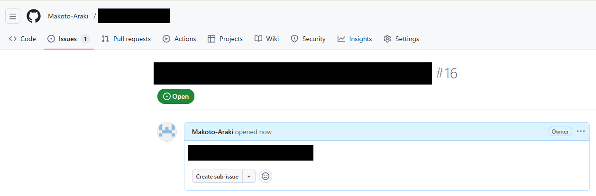
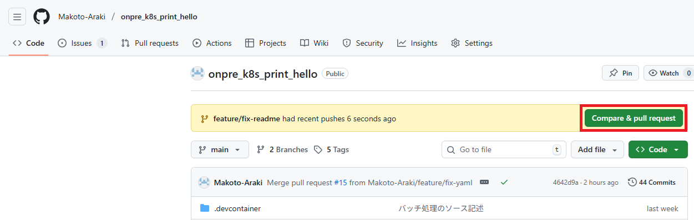
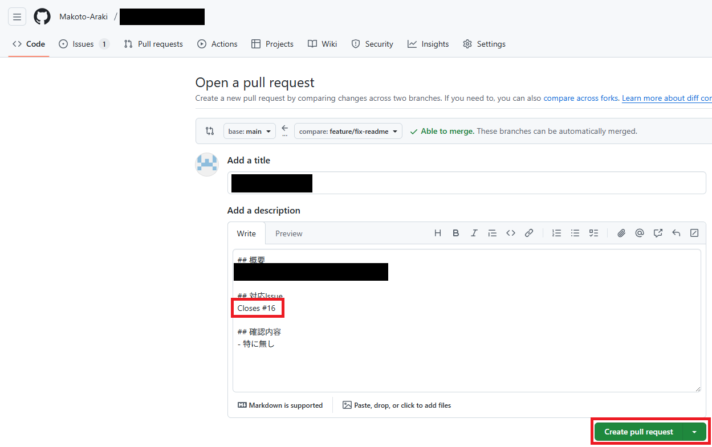
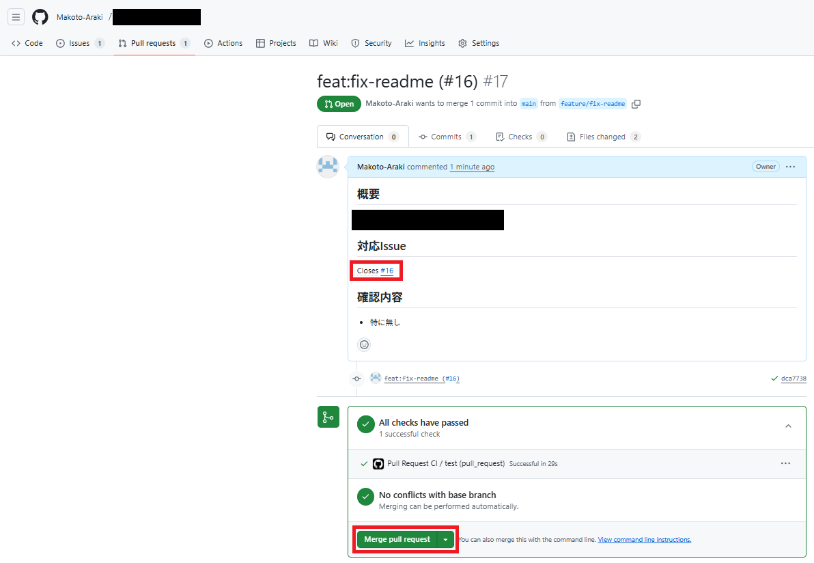
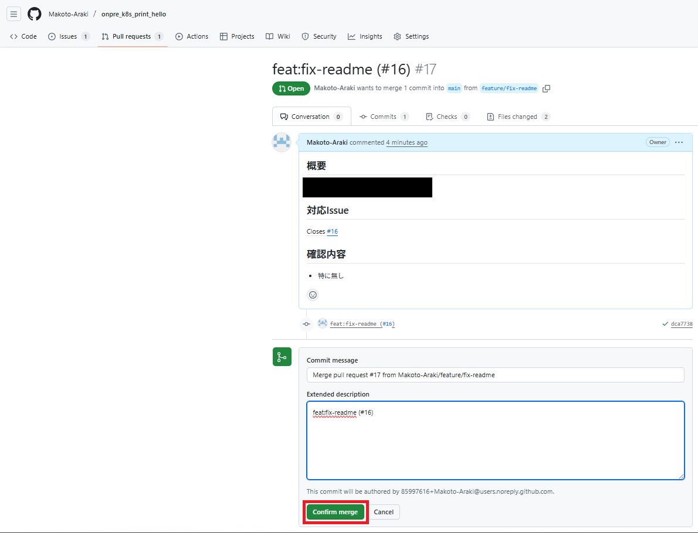
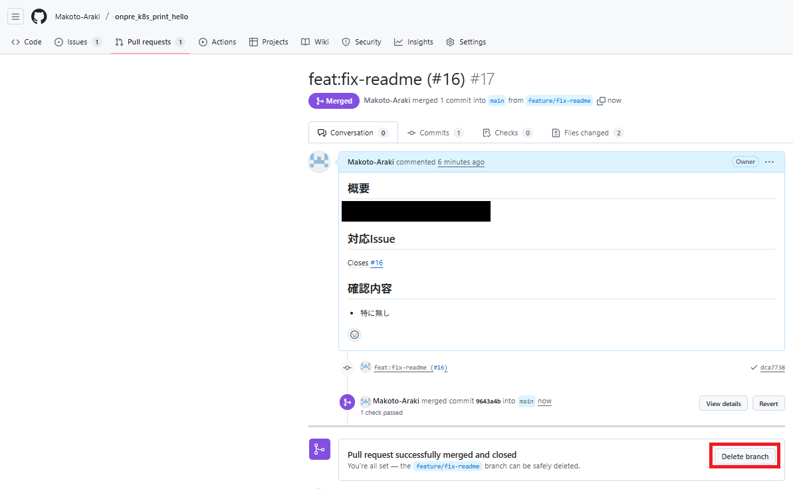
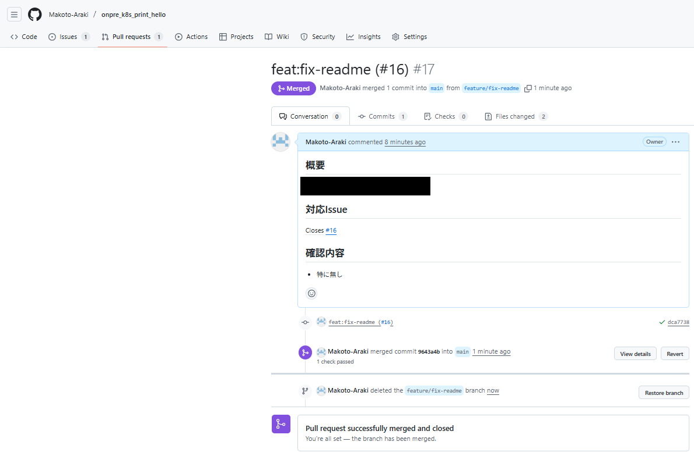

# onpre_k8s_return_hello (APIサーバー)

## プログラム開発
### Github上でIssue作成


### ローカルリポジトリ上で開発
```bash
## ディレクトリ作成
$ cd ~
$ mkdir onpre_k8s_return_hello

## ローカルリポジトリ初期化
$ cd ~/onpre_k8s_return_hello
$ git init

## ローカルリポジトリ設定 
$ git config --global user.email (自分のメールアドレス)
$ git config --global user.name Makoto-Araki

## ローカルリポジトリ設定
$ cd ~/onpre_k8s_return_hello
$ git branch -M main

## リモートリポジトリ設定
$ cd ~/onpre_k8s_return_hello
$ git remote add origin git@github.com:Makoto-Araki/onpre_k8s_return_hello.git

## ブランチ確認
$ cd ~/onpre_k8s_return_hello
$ git branch

## 別ブランチ作成
$ cd ~/onpre_k8s_return_hello
$ git checkout -b feature/add-basicfiles

## 別ブランチをリモートリポジトリに反映
$ cd ~/onpre_k8s_return_hello
$ git push -u origin feature/add-basicfiles

## 開発イメージ用のDockerfile作成
$ cd ~/onpre_k8s_return_hello
$ vi Dockerfile

## プログラム用ディレクトリ作成
$ cd ~/onpre_k8s_return_hello
$ mkdir app

## プログラム作成
$ cd ~/onpre_k8s_return_hello
$ vi app/main.py

## テスト用ディレクトリ作成
$ cd ~/onpre_k8s_return_hello
$ mkdir tests

## テスト用設定ファイル作成
$ cd ~/onpre_k8s_return_hello
$ vi tests/conftest.py

## テスト用プログラム作成
$ cd ~/onpre_k8s_return_hello
$ vi tests/test_main.py

## パッケージリスト作成
$ cd ~/onpre_k8s_return_hello
$ vi requirements.txt

## 開発コンテナのディレクトリ作成
$ cd ~/onpre_k8s_return_hello
$ mkdir .devcontainer

## 開発コンテナの設定ファイル作成
$ cd ~/onpre_k8s_return_hello
$ vi .devcontainer/devcontainer.json

## Kubernetes用のディレクトリ作成
$ cd ~/onpre_k8s_return_hello
$ mkdir k8s

## Kubernetes用のYAML作成
$ cd ~/onpre_k8s_return_hello
$ vi k8s/deployment.yaml

## Kubernetes用のYAML作成
$ cd ~/onpre_k8s_return_hello
$ vi k8s/service.yaml

## VSCode用のディレクトリ作成
$ cd ~/onpre_k8s_return_hello
$ mkdir .vscode

## VSCode用の設定ファイル作成
$ cd ~/onpre_k8s_return_hello
$ vi .vscode/settings.json

## Github-Actions用のディレクトリ作成
$ cd ~/onpre_k8s_return_hello
$ mkdir -p .github/workflows

## Github-Actions用のYAMLファイル作成
$ cd ~/onpre_k8s_return_hello
$ vi .github/workflows/pull_request_ci.yaml

## Github-Actions用のYAMLファイル作成
$ cd ~/onpre_k8s_return_hello
$ vi .github/workflows/main_ci.yaml

## Github-Actions用のYAMLファイル作成
$ cd ~/onpre_k8s_return_hello
$ vi .github/workflows/release.yaml

## 開発イメージビルド
$ cd ~/onpre_k8s_return_hello
$ docker build --no-cache -t onpre_k8s_return_hello_image .

## 開発イメージからVSCode上で開発コンテナ起動
$ cd ~/onpre_k8s_return_hello
$ code .

## 開発コンテナ上でテストプログラム実行
$ cd ~
$ pytest tests/test_main.py

## 開発コンテナ上でアプリ起動 ※開発コンテナ上では Dockerfile のCMDは実行されない
$ cd ~
$ uvicorn app.main:app --host 0.0.0.0 --port 8000

## 開発コンテナ上で動作確認 ※動作確認後は Ctrl + C でアプリ終了
$ cd ~
$ curl http://localhost:8000 ※ブラウザ上でhttp//localhost:8000のURLを閲覧しても可

## 別ブランチをステージング移行
$ cd ~/onpre_k8s_return_hello
$ git add .

## 別ブランチをコミット
$ cd ~/onpre_k8s_return_hello
$ git commit -m "feature/add-basicfiles(#1)" ※#1はIssue番号

## 別ブランチをプッシュ
$ cd ~/onpre_k8s_return_hello
$ git push origin feature/add-basicfiles
```

### GithubでPR作成1


### GithubでPR作成2


### Githubでマージ1


### Githubでマージ2


### Githubの別ブランチをマージ後に削除1


### Githubの別ブランチをマージ後に削除2


### Githubからmainブランチをプル
```bash
## ブランチ確認
$ cd ~/onpre_k8s_return_hello
$ git branch

## ブランチをmainブランチに戻す
$ cd ~/onpre_k8s_return_hello
$ git checkout main

## Github上のmainブランチの内容をプル
$ cd ~/onpre_k8s_return_hello
$ git pull origin main

## 別ブランチを削除
$ cd ~/onpre_k8s_return_hello
$ git branch -d feature/add-basicfiles
```
